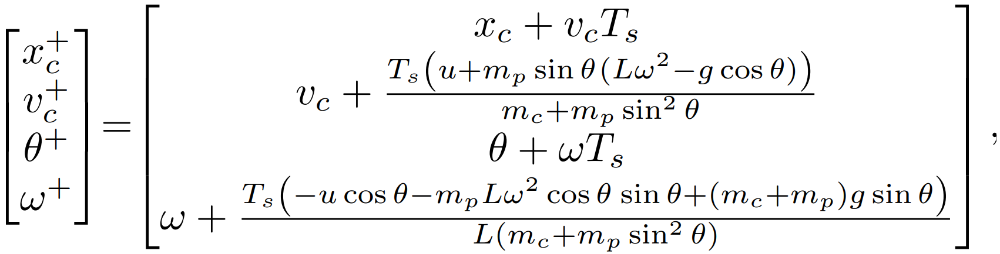

# Verification and Synthesis of Discrete-Time Control Barrier Functions (DTCBFs)

Discrete-Time Control Barrier Functions (DTCBFs) have recently attracted significant attention for guaranteeing safety and designing safe controllers for discrete-time dynamical systems.  

This repository provides implementations of methods for:

1. **Verification of candidate DTCBFs**  
   - A branch-and-bound method inspired by the αBB algorithm.  
   - Handles both cases where a corresponding control policy is known or unknown.  
   - Guarantees that, in a finite number of iterations, the algorithm either:  
     - Verifies the candidate as a valid DTCBF, or  
     - Provides a counterexample (within predefined tolerances).  

2. **Synthesis of DTCBFs and corresponding control policies**  
   - A bilevel optimization approach for synthesizing both a DTCBF and a control policy in finite time.  
   - Determines unknown coefficients of parameterized DTCBFs and policies.  

---

## Repository Structure

- `verification_DTCBFs/` → Code for the verification algorithm.  
- `synthesis_DTCBFs_bilevel/` → Code for the synthesis algorithm.  

Both are demonstrated on the discretized cart-pole system, explained below.

---

## Cart-Pole Example

The cart-pole dynamics are 

**State variables**  
- `x_c` – horizontal cart position  
- `v_c` – cart velocity  
- `θ` – pole angle (measured from the upright position)  
- `ω` – pole angular velocity  

**Control input**  
- `u ∈ [-25, 25]` – horizontal force applied to the cart  

**System parameters**  
- Cart mass: `m_c = 2 kg`  
- Pole mass: `m_p = 0.1 kg`  
- Pole length: `L = 1 m`  
- Sampling time: `T_s = 0.01 s`  

We require the pole angle and angular velocity to remain bounded within:

**Safe set**  

S = { x \in R^4 | θ^2 + ω^2 <= (pi/4)^2 }

Our goal is to **synthesize DTCBF and a corresponding control policy `π`** for the discretized cart-pole system.  
As a cross-check, we then verify whether the synthesized DTCBF is valid through the verification algrotihm.  

---

If you find this code useful, please cite our paper

@article{Shakhesi2025DTCBFs,
  title     = {Verification and Synthesis of Discrete-Time Control Barrier Functions (DTCBFs)},
  author    = {Erfan Shakhesi and W.P.M.H. (Maurice) Heemels and Alexander Katriniok},
  journal   = {IEEE Transactions on Automatic Control},
  year      = {2025}
}
